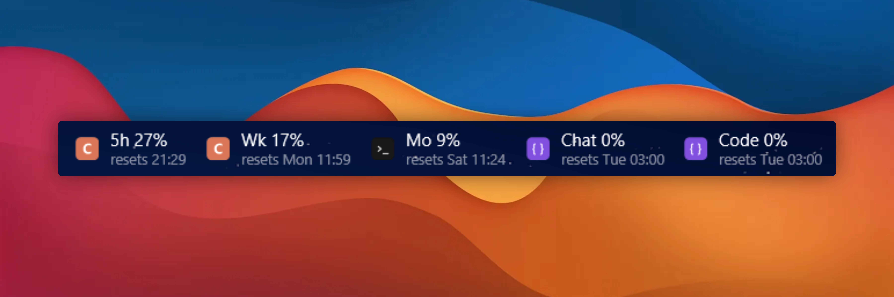
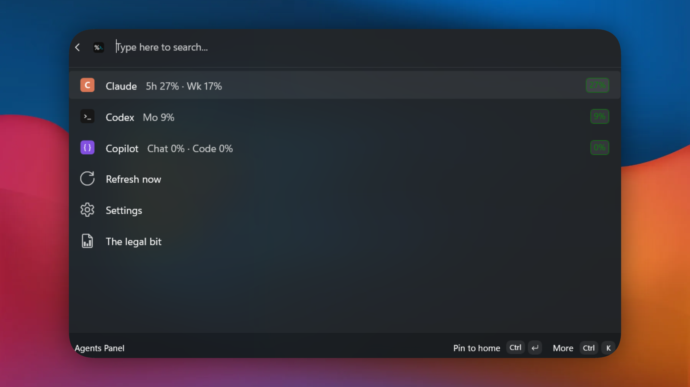
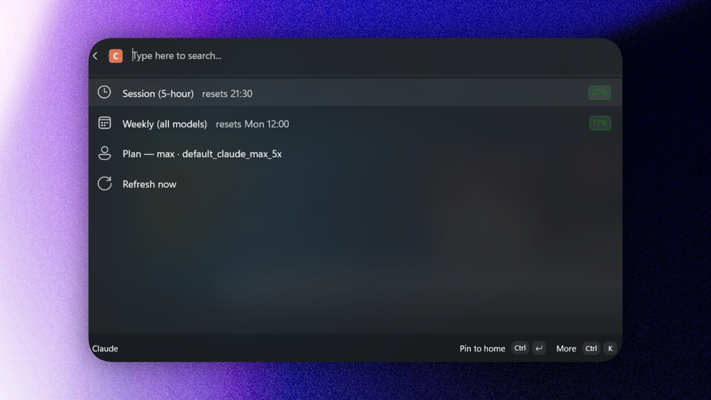
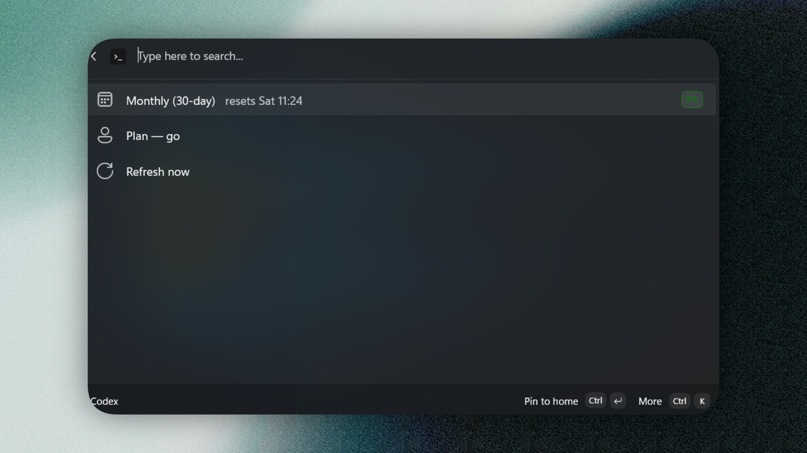
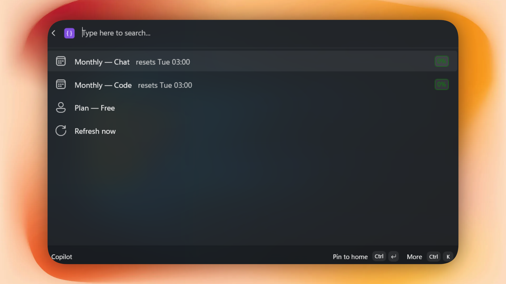
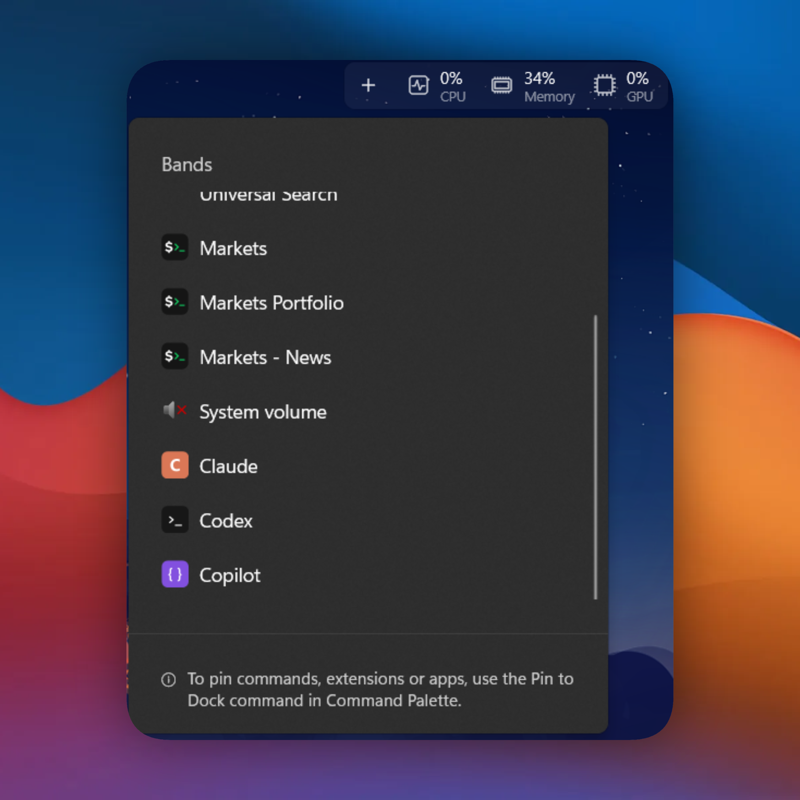

# Agents Panel for Command Palette

[](https://github.com/CostaFot/agents-panel-extension/releases/latest)
[](https://github.com/CostaFot/agents-panel-extension/releases)



A Windows 11 [Command Palette](https://learn.microsoft.com/en-us/windows/powertoys/command-palette/overview) (PowerToys) extension that shows your AI agents' **usage** on the Command Palette dock.

## Requirements
[PowerToys](https://github.com/microsoft/PowerToys) with Command Palette enabled

... and any/either of:
- Claude Code signed in with a Pro/Max account
- Codex CLI or desktop app signed in
- A local GitHub Copilot sign-in, or a fine-grained PAT with *Copilot Requests: Read*

## Installation

### Microsoft Store

<a href="https://apps.microsoft.com/detail/9N8KK0W45HG8" target="_self">
	
</a>

<!-- TODO after the WinGet submission is merged: uncomment.
### WinGet

```powershell
winget install --id CostaFotiadis.AgentsPanelForCommandPalette
```
-->

Winget when I get to it.

## Features

### The Agents Panel hub

One top-level **Agents Panel** command opens the hub. 



### Claude



### Codex



### Copilot



### Dock integration

Each agent is its own dock band with quick-look buttons like `5h 27%` and `Wk 17%` that live-update while pinned and click through to the full panel.




## FAQ

**Will you steal my tokens?**

I don't care about your tokens. Read the source code.

**Is this official?**

No. The usage endpoints are undocumented; this extension polls them (3-minute minimum, configurable). 

NO GUARANTEES :)

**Is there telemetry?**

No. 

**Do I need an account?**

Only the subscriptions of the agents you already use.

## License

[MIT](LICENSE)
